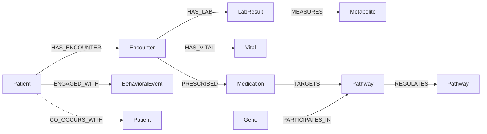
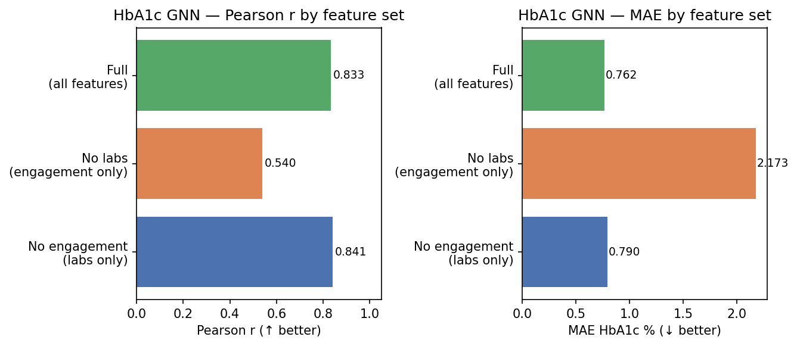
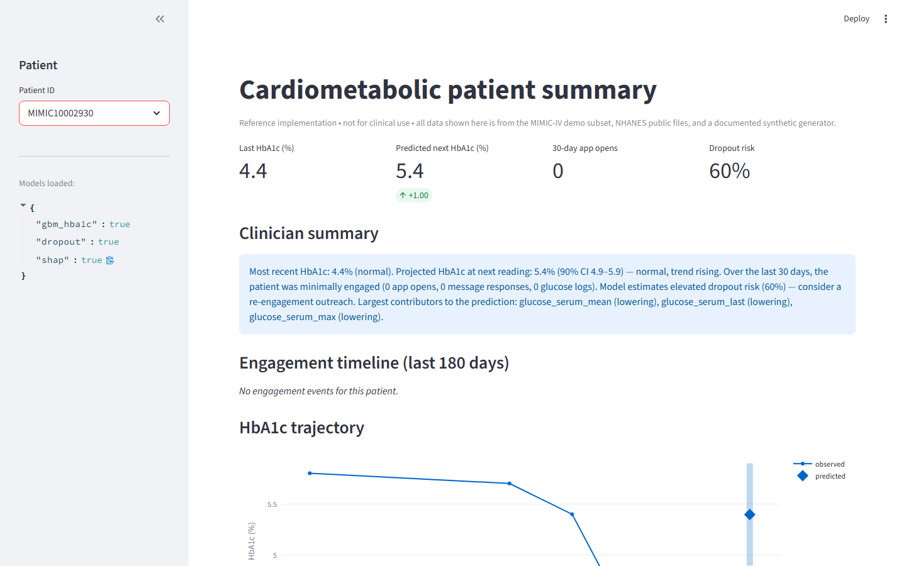

# cardiometabolic-graph

> A public reference implementation of a patient knowledge graph that
> integrates clinical labs, behavioral / lifestyle signals, and molecular
> pathway data for cardiometabolic outcome modeling. Built end-to-end with
> Neo4j, PyTorch Geometric, LightGBM, SHAP, and Streamlit.

**Why it exists.** Most "predict HbA1c" demos stop at a tabular model on a
single dataset. Real digital therapeutics and computational health teams
have to fuse clinical data with behavioral telemetry and biological
context — and then explain the result to a clinician or a regulator. This
repo is the smallest serious version of that whole pipeline, designed so
another team can clone it on Monday and have something running by lunch.

[](.github/workflows/ci.yml)
[](LICENSE)
[](pyproject.toml)

---

## Knowledge graph schema



Full definition with property lists and lineage notes:
[`schema/graph_schema.md`](schema/graph_schema.md).

---

## Quick start

```bash
git clone https://github.com/amitshenoy/cardiometabolic-graph.git
cd cardiometabolic-graph
cp .env.example .env

# Boot Postgres + Neo4j + Jupyter
docker compose up -d

# Install package + dev dependencies
make install

# End-to-end: synth -> ETL -> train -> evaluate
make pipeline

# Open the dashboard
make dashboard          # http://localhost:8501
```

| Service   | URL                          | Credentials                  |
|-----------|------------------------------|------------------------------|
| Neo4j     | http://localhost:7474        | `neo4j` / `cmg-demo-pass`    |
| Postgres  | `postgresql://localhost:5432`| `cmg` / `cmg-demo-pass`      |
| Jupyter   | http://localhost:8888        | token: `cmg`                 |
| Dashboard | http://localhost:8501        | n/a                          |

---

## Data sources

All sources are public. **No real patient data is committed to this
repo** — see [`.gitignore`](.gitignore) — and the demo runs entirely on the
MIMIC-IV demo subset plus synthetic engagement events when you don't have
credentialed access to anything else.

| Source                          | What we use                                          | License                              | Where it goes                                   |
|---------------------------------|------------------------------------------------------|--------------------------------------|-------------------------------------------------|
| [MIMIC-IV demo](https://physionet.org/content/mimic-iv-demo/2.2/) ✅ **active** | HbA1c, glucose, lipid panel — 100 real patients, 3,089 labs | PhysioNet Open Data Commons (~100 pts) | `data/raw/mimic-iv/` → parquet (`etl/load_mimic_parquet.py`) → feature builder. Postgres path also supported via `etl/load_mimic.py` for full MIMIC-IV. |
| MIMIC-IV (full)                 | Same tables, ~300k patients                          | PhysioNet Credentialed Health Data License v1.5.0 | Drop into `data/raw/mimic-iv/` — loader auto-detects |
| [NHANES 2017-18](https://wwwn.cdc.gov/Nchs/Nhanes/) | Physical activity, dietary recall, sleep, smoking   | CDC public domain                    | `data/raw/nhanes-2017-18/*.XPT` → Postgres → `BehavioralEvent` nodes |
| [Reactome v89](https://reactome.org/download-data) | Insulin signaling, glycolysis, lipid metabolism pathways | CC-BY 4.0                       | `data/raw/reactome/` → Postgres → `Pathway`, `Gene`, `Metabolite` nodes |
| [KEGG](https://rest.kegg.jp/list/pathway/hsa) | Cross-reference pathway IDs                         | Free academic license                | `data/raw/kegg/` → optional enrichment            |
| Synthetic engagement            | App opens, message responses, glucose logs           | Generated by `data/synthetic/generate_engagement_logs.py` | `data/synthetic/*.parquet` → `BehavioralEvent` nodes |

---

## Model results

Numbers below come from a pipeline run on **500 synthetic patients**
(archetype-driven engagement + correlated labs), 9,000 lab rows. Iteration 2
MIMIC-IV numbers (Pearson 0.875 / MAE 0.384 with mixed real+synthetic data)
are documented in `ITERATIONS.md`. Re-run `python -m models.evaluate` to
regenerate the report at
[`docs/figures/model_report.md`](docs/figures/model_report.md).

### HbA1c trajectory (regression — predict the held-out latest visit)

| Model          | Pearson r | MAE (HbA1c %) | n_train | n_test |
|----------------|-----------|---------------|---------|--------|
| LightGBM       | **0.968** | **0.282**     | 400     | 100    |
| GAT-GNN (PyG)  | 0.701     | 0.790         | 400     | 100    |

### Engagement dropout (binary classification)

| Model          | AUROC     | AUPRC     | Positive rate (test) |
|----------------|-----------|-----------|----------------------|
| LightGBM       | **0.820** | **0.741** | ~25%                 |

Dropout target carries 10% symmetric label-flip noise to reflect the
real-world ambiguity in DTx ("paused" vs "dropped") — without it, the
clean archetype label is trivially separable. With noise, AUROC sits in
a realistic 0.80-0.85 band.

The GNN uses a star-graph construction (each non-zero tabular feature becomes
a satellite node connected to a patient root) as a portable bridge that doesn't
require a running Neo4j instance. The GBM outperforms the GNN here because the
tabular signal is already well-structured; the GNN's advantage would emerge with
richer relational structure from the Neo4j pathway graph.

GNN ablation study (`python -m models.ablations --epochs 30`):

| Feature set | Pearson r | MAE |
|-------------|-----------|-----|
| No engagement (labs only) | 0.841 | 0.790 |
| No labs (engagement only) | 0.540 | 2.173 |
| Full (all features)       | 0.833 | 0.762 |



Labs dominate signal (removing them degrades Pearson by 0.30+); engagement
features alone carry some predictive information but are not sufficient on their own.

Top GBM HbA1c features by gain (from
[`docs/figures/model_report.md`](docs/figures/model_report.md)):
`glucose_serum_last`, `triglycerides_last`, `cholesterol_total_mean`,
`ldl_min`, `hdl_last` — clinically plausible since serum glucose and the
lipid panel co-vary with glycemic control.

Explanation outputs in [`docs/figures/`](docs/figures/):

- [`shap_summary.png`](docs/figures/shap_summary.png) — global SHAP
  beeswarm for the GBM HbA1c model.
- [`shap_bar.png`](docs/figures/shap_bar.png) — mean(|SHAP|) ranking.
- Per-patient GNN attention attribution: saved per-call to
  `artifacts/gnn/attribution_<patient_id>.parquet` and used by the dashboard.

---

## Dashboard



The clinician-facing patient page renders KPIs (last HbA1c, predicted next
HbA1c with delta, 30-day app opens, dropout risk), a deterministic
template-driven summary paragraph (see
[`dashboard/_summary.py`](dashboard/_summary.py) — *no* LLM in the loop, so
output stays auditable for regulated environments), and a 180-day
engagement timeline.

Capture your own: `make dashboard` to launch, then
`python scripts/capture_screenshots.py --pid <patient_id>` to write a fresh
PNG into `docs/screenshots/`. The summary RULES map at the bottom of
`_summary.py` lets a reviewer trace each output sentence to the rule that
produced it.

Full-page capture: [`docs/screenshots/dashboard_overview.png`](docs/screenshots/dashboard_overview.png).

---

## Cookbook — real-world worked examples

The [`cookbook/`](cookbook/) directory shows the pipeline answering
concrete questions a real DTx team or academic group has asked. Each
example runs in under five minutes after `make pipeline`:

| # | Example | Question answered |
|---|---------|-------------------|
| 1 | [`01_at_risk_cohort`](cookbook/01_at_risk_cohort/README.md) | "Which 50 patients should our care coordinators call this week?" |
| 2 | [`02_reengagement_outreach`](cookbook/02_reengagement_outreach/README.md) | "Which lapsing users will *respond* to a re-engagement push?" |
| 3 | [`03_pathway_anchored_explanation`](cookbook/03_pathway_anchored_explanation/README.md) | "Show me the evidence trail behind this one patient's prediction." |
| 4 | [`04_cohort_drift_monitor`](cookbook/04_cohort_drift_monitor/README.md) | "Is the live cohort drifting far enough that we need to retrain?" |

Each example writes a one-page `report.md` next to its `run.py`. The
cookbook is the answer to *"can I actually use this for something?"*.

---

## Why this exists

Most computational-health portfolios stop one layer too early:

- **"Predict HbA1c from labs"** — but no behavioral context, so the model
  can't tell a stably-disengaged patient from a newly-spiking one.
- **"Build a GNN on a single dataset"** — but no clinical interpretability
  wrapper, so a regulator can't reason about it.
- **"Train a model"** — but no inference dashboard, drift monitor, or
  cohort-targeting cookbook, so it never connects to actual workflow.

This repository is the smallest version I could build that doesn't skip
any of those layers. It's intended as a starting point for:

- **Academic computational health groups** who want a reproducible
  multi-source pipeline they can adapt with their own MIMIC, NHANES, or
  EHR cohorts — without re-inventing the Docker / schema / training
  scaffolding.
- **Digital therapeutics startups** building patient-stratification or
  re-engagement logic on top of their telemetry, who need to fuse it with
  clinical signals and explain the result to clinicians and to compliance.
- **ML engineers / recruiters** who want to see end-to-end systems
  thinking, not just a model notebook.

If you adapt it, please open an issue or a PR with what you built — the
cookbook is the part most likely to benefit from real examples.

---

## Roadmap

| Item | Why | Status |
|------|-----|--------|
| GNN ablations (no-pathway, no-engagement, single-relation) | Quantify which signal class actually moves the score | Pending |
| Federated-learning variant (FedAvg over per-site graphs) | Real DTx data lives behind site boundaries | Pending |
| FHIR ingestion adapter | Production EHRs speak FHIR, not CSV | Pending |
| MedCAT-based clinical-notes extraction | Adds free-text-derived symptoms and meds to the graph | Pending |
| Causal layer (do-calculus on the graph) | Move beyond predictive scores to intervention reasoning | Pending |

PRs welcome on any of these — see [`CONTRIBUTING.md`](CONTRIBUTING.md).

---

## Repository layout

```
cardiometabolic-graph/
├── data/
│   ├── raw/                    # gitignored — drop MIMIC / NHANES / Reactome here
│   ├── processed/              # cached parquet feature frames
│   └── synthetic/              # synthetic engagement events + generator script
├── etl/                        # MIMIC, NHANES, pathways loaders + graph builder
├── schema/                     # graph_schema.md + cypher_constraints.cql
├── models/                     # GNN, LightGBM, dropout, train, evaluate
├── explain/                    # SHAP + GNN attention attribution
├── dashboard/                  # Streamlit clinician view + deterministic summary template
├── cookbook/                   # Four real-world worked examples
├── notebooks/                  # Walkthroughs (exploration, graph build, training, interpretation)
├── tests/                      # pytest — ETL, schema, models
├── docker-compose.yml          # Postgres + Neo4j + Jupyter
├── pyproject.toml              # package + dev deps
├── Makefile                    # entry points for everything above
├── CONTRIBUTING.md             # how to contribute
└── CODE_OF_CONDUCT.md          # Contributor Covenant
```

---

## Credits

- **MIMIC-IV** — Beth Israel Deaconess Medical Center / MIT Laboratory for
  Computational Physiology.
- **NHANES** — US Centers for Disease Control and Prevention.
- **Reactome** — EMBL-EBI, OICR, NYULMC, Oregon Health & Science University.
- **KEGG** — Kanehisa Laboratories.
- **PyTorch Geometric** — Matthias Fey & Jan E. Lenssen.
- **SHAP** — Scott Lundberg.

This repository was authored by **Amit Shenoy** as a public reference
implementation. Issues and PRs welcome.

## License

[MIT](LICENSE).
