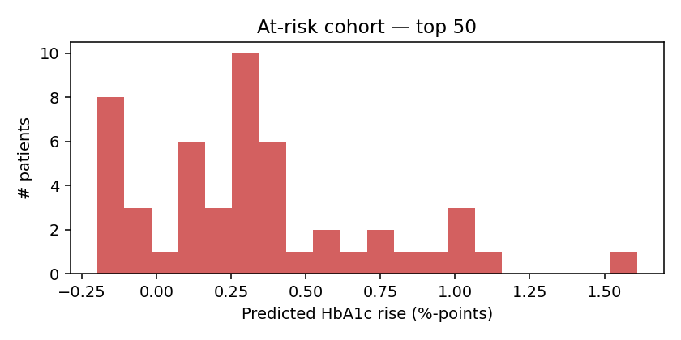

# Weekly at-risk cohort

_Top 50 patients by predicted HbA1c rise over the next 90 days._

| Rank | Patient | Last HbA1c | Predicted | Δ | Why |
|------|---------|------------|-----------|---|-----|
| 1 | `SYN000333` | 7.3% | 8.9% | +1.61 | HbA1c last observed at 7.3%. Top factors: glucose_serum_last (raising), glucose_serum_max (raising), HbA1c_max (raising). |
| 2 | `SYN000109` | 6.2% | 7.3% | +1.11 | HbA1c last observed at 6.2%. Top factors: glucose_serum_last (raising), HbA1c_min (lowering), glucose_serum_max (lowering). |
| 3 | `SYN000467` | 7.9% | 8.9% | +1.01 | HbA1c last observed at 7.9%. Top factors: glucose_serum_last (raising), glucose_serum_mean (raising), ldl_min (raising). |
| 4 | `SYN000300` | 9.2% | 10.2% | +1.00 | HbA1c last observed at 9.2%. Top factors: glucose_serum_last (raising), glucose_serum_mean (raising), glucose_serum_max (raising). |
| 5 | `SYN000482` | 6.8% | 7.8% | +0.98 | HbA1c last observed at 6.8%. Top factors: glucose_serum_last (raising), glucose_serum_mean (raising), glucose_serum_max (lowering). |
| 6 | `SYN000237` | 7.8% | 8.8% | +0.97 | HbA1c last observed at 7.8%. Top factors: glucose_serum_last (raising), triglycerides_last (raising), glucose_serum_max (raising). |
| 7 | `SYN000491` | 7.3% | 8.1% | +0.80 | HbA1c last observed at 7.3%. Top factors: glucose_serum_last (raising), glucose_serum_mean (raising), glucose_serum_max (lowering). |
| 8 | `SYN000372` | 6.9% | 7.6% | +0.74 | HbA1c last observed at 6.9%. Top factors: glucose_serum_last (raising), glucose_serum_mean (raising), glucose_serum_max (lowering). |
| 9 | `SYN000065` | 6.9% | 7.6% | +0.74 | HbA1c last observed at 6.9%. Top factors: glucose_serum_last (raising), glucose_serum_mean (raising), glucose_serum_max (lowering). |
| 10 | `SYN000325` | 7.3% | 7.9% | +0.65 | HbA1c last observed at 7.3%. Top factors: glucose_serum_last (raising), glucose_serum_mean (raising), glucose_serum_max (lowering). |
| 11 | `SYN000125` | 7.1% | 7.7% | +0.56 | HbA1c last observed at 7.1%. Top factors: glucose_serum_last (raising), glucose_serum_mean (raising), glucose_serum_max (lowering). |
| 12 | `SYN000456` | 7.6% | 8.2% | +0.56 | HbA1c last observed at 7.6%. Top factors: glucose_serum_last (raising), glucose_serum_mean (raising), glucose_serum_max (raising). |
| 13 | `SYN000430` | 9.9% | 10.4% | +0.49 | HbA1c last observed at 9.9%. Top factors: glucose_serum_last (raising), glucose_serum_mean (raising), triglycerides_last (raising). |
| 14 | `SYN000440` | 8.0% | 8.4% | +0.39 | HbA1c last observed at 8.0%. Top factors: glucose_serum_last (raising), triglycerides_last (raising), glucose_serum_mean (raising). |
| 15 | `SYN000023` | 8.5% | 8.9% | +0.39 | HbA1c last observed at 8.5%. Top factors: glucose_serum_last (raising), glucose_serum_max (raising), glucose_serum_mean (raising). |
| 16 | `SYN000267` | 7.7% | 8.1% | +0.38 | HbA1c last observed at 7.7%. Top factors: glucose_serum_last (raising), triglycerides_last (raising), glucose_serum_mean (raising). |
| 17 | `SYN000458` | 8.0% | 8.4% | +0.38 | HbA1c last observed at 8.0%. Top factors: glucose_serum_last (raising), glucose_serum_mean (raising), HbA1c_mean (raising). |
| 18 | `SYN000117` | 8.4% | 8.8% | +0.37 | HbA1c last observed at 8.4%. Top factors: glucose_serum_last (raising), glucose_serum_max (raising), glucose_serum_mean (raising). |
| 19 | `SYN000290` | 6.8% | 7.2% | +0.37 | HbA1c last observed at 6.8%. Top factors: glucose_serum_last (raising), glucose_serum_mean (lowering), ev_bucket_3 (raising). |
| 20 | `SYN000022` | 8.5% | 8.8% | +0.34 | HbA1c last observed at 8.5%. Top factors: glucose_serum_last (raising), glucose_serum_mean (raising), HbA1c_min (raising). |
| 21 | `SYN000074` | 6.3% | 6.6% | +0.32 | HbA1c last observed at 6.3%. Top factors: glucose_serum_last (lowering), hdl_last (raising), triglycerides_max (lowering). |
| 22 | `SYN000006` | 8.6% | 8.9% | +0.32 | HbA1c last observed at 8.6%. Top factors: glucose_serum_last (raising), triglycerides_last (raising), glucose_serum_max (raising). |
| 23 | `SYN000031` | 8.4% | 8.7% | +0.30 | HbA1c last observed at 8.4%. Top factors: glucose_serum_last (raising), glucose_serum_mean (raising), HbA1c_mean (raising). |
| 24 | `SYN000287` | 8.4% | 8.7% | +0.29 | HbA1c last observed at 8.4%. Top factors: glucose_serum_last (raising), glucose_serum_mean (raising), triglycerides_last (raising). |
| 25 | `SYN000240` | 8.0% | 8.3% | +0.27 | HbA1c last observed at 8.0%. Top factors: glucose_serum_last (raising), glucose_serum_mean (raising), HbA1c_mean (raising). |
| 26 | `SYN000122` | 6.1% | 6.3% | +0.27 | HbA1c last observed at 6.1%. Top factors: glucose_serum_last (lowering), HbA1c_min (lowering), glucose_serum_min (lowering). |
| 27 | `SYN000141` | 7.1% | 7.4% | +0.27 | HbA1c last observed at 7.1%. Top factors: glucose_serum_last (raising), glucose_serum_mean (raising), ev_bucket_3 (lowering). |
| 28 | `SYN000010` | 7.3% | 7.6% | +0.26 | HbA1c last observed at 7.3%. Top factors: glucose_serum_last (raising), glucose_serum_mean (raising), ev_bucket_4 (lowering). |
| 29 | `SYN000063` | 7.3% | 7.6% | +0.26 | HbA1c last observed at 7.3%. Top factors: glucose_serum_last (raising), glucose_serum_mean (raising), glucose_serum_max (lowering). |
| 30 | `SYN000398` | 7.3% | 7.5% | +0.25 | HbA1c last observed at 7.3%. Top factors: glucose_serum_last (raising), glucose_serum_mean (raising), glucose_serum_max (lowering). |
| 31 | `SYN000041` | 8.6% | 8.8% | +0.23 | HbA1c last observed at 8.6%. Top factors: glucose_serum_last (raising), glucose_serum_max (raising), glucose_serum_mean (raising). |
| 32 | `SYN000001` | 6.3% | 6.5% | +0.19 | HbA1c last observed at 6.3%. Top factors: glucose_serum_last (lowering), hdl_last (lowering), glucose_serum_mean (raising). |
| 33 | `SYN000137` | 7.5% | 7.6% | +0.14 | HbA1c last observed at 7.5%. Top factors: glucose_serum_last (raising), glucose_serum_mean (raising), glucose_serum_max (lowering). |
| 34 | `SYN000116` | 6.5% | 6.6% | +0.12 | HbA1c last observed at 6.5%. Top factors: glucose_serum_last (lowering), glucose_serum_mean (lowering), triglycerides_last (lowering). |
| 35 | `SYN000297` | 7.4% | 7.5% | +0.12 | HbA1c last observed at 7.4%. Top factors: glucose_serum_last (raising), glucose_serum_mean (raising), glucose_serum_max (lowering). |
| 36 | `SYN000105` | 7.7% | 7.8% | +0.11 | HbA1c last observed at 7.7%. Top factors: glucose_serum_last (raising), triglycerides_last (raising), glucose_serum_mean (raising). |
| 37 | `SYN000182` | 6.9% | 7.0% | +0.08 | HbA1c last observed at 6.9%. Top factors: glucose_serum_last (lowering), glucose_serum_mean (raising), glucose_serum_min (raising). |
| 38 | `SYN000303` | 7.2% | 7.3% | +0.07 | HbA1c last observed at 7.2%. Top factors: glucose_serum_last (raising), glucose_serum_mean (raising), glucose_serum_max (lowering). |
| 39 | `SYN000420` | 6.3% | 6.3% | +0.04 | HbA1c last observed at 6.3%. Top factors: glucose_serum_last (lowering), glucose_serum_mean (lowering), triglycerides_last (lowering). |
| 40 | `SYN000129` | 8.5% | 8.4% | -0.02 | HbA1c last observed at 8.5%. Top factors: glucose_serum_last (raising), glucose_serum_max (raising), glucose_serum_mean (raising). |
| 41 | `SYN000437` | 6.8% | 6.7% | -0.10 | HbA1c last observed at 6.8%. Top factors: glucose_serum_last (lowering), glucose_serum_mean (lowering), hdl_last (raising). |
| 42 | `SYN000497` | 6.9% | 6.8% | -0.10 | HbA1c last observed at 6.9%. Top factors: glucose_serum_last (lowering), HbA1c_mean (raising), hdl_last (lowering). |
| 43 | `SYN000102` | 7.5% | 7.4% | -0.12 | HbA1c last observed at 7.5%. Top factors: glucose_serum_last (raising), glucose_serum_mean (raising), hdl_last (lowering). |
| 44 | `SYN000015` | 6.7% | 6.6% | -0.13 | HbA1c last observed at 6.7%. Top factors: glucose_serum_last (lowering), hdl_last (raising), HbA1c_min (raising). |
| 45 | `SYN000275` | 8.3% | 8.1% | -0.13 | HbA1c last observed at 8.3%. Top factors: glucose_serum_last (raising), glucose_serum_mean (raising), HbA1c_mean (raising). |
| 46 | `SYN000034` | 7.5% | 7.3% | -0.16 | HbA1c last observed at 7.5%. Top factors: glucose_serum_mean (raising), glucose_serum_last (raising), glucose_serum_max (lowering). |
| 47 | `SYN000451` | 9.9% | 9.7% | -0.16 | HbA1c last observed at 9.9%. Top factors: glucose_serum_last (raising), glucose_serum_mean (raising), HbA1c_min (raising). |
| 48 | `SYN000157` | 9.6% | 9.5% | -0.20 | HbA1c last observed at 9.6%. Top factors: glucose_serum_last (raising), glucose_serum_mean (raising), HbA1c_min (raising). |
| 49 | `SYN000187` | 6.7% | 6.5% | -0.20 | HbA1c last observed at 6.7%. Top factors: glucose_serum_last (lowering), glucose_serum_mean (raising), hdl_last (raising). |
| 50 | `SYN000208` | 6.8% | 6.6% | -0.20 | HbA1c last observed at 6.8%. Top factors: glucose_serum_last (lowering), glucose_serum_mean (raising), HbA1c_min (raising). |

