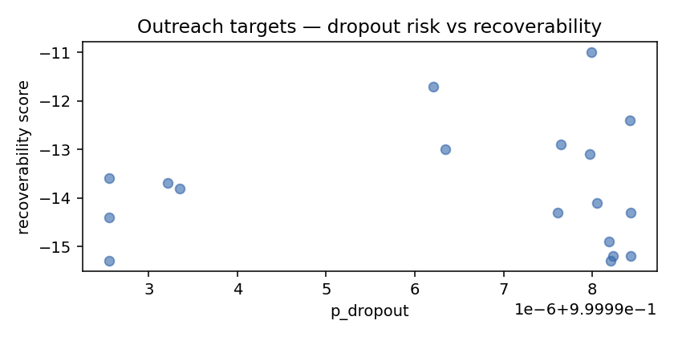

# Re-engagement outreach targets

_Top 18 lapsing-but-recoverable patients._

Sort by `recoverability` desc. Suggested workflow: A/B test the top quartile against an unsent control to measure model uplift.

| patient_id   |   p_dropout |   recoverability |   days_since_last_open |   recent_app_open |   recent_message_response |   recent_glucose_log |   prior_app_open |
|:-------------|------------:|-----------------:|-----------------------:|------------------:|--------------------------:|---------------------:|-----------------:|
| SYN000177    |    0.999998 |            -11   |                    110 |                 0 |                         0 |                    0 |                0 |
| SYN000440    |    0.999996 |            -11.7 |                    117 |                 0 |                         0 |                    0 |                0 |
| SYN000190    |    0.999998 |            -12.4 |                    124 |                 0 |                         0 |                    0 |                0 |
| SYN000333    |    0.999998 |            -12.9 |                    129 |                 0 |                         0 |                    0 |                0 |
| SYN000456    |    0.999996 |            -13   |                    130 |                 0 |                         0 |                    0 |                0 |
| SYN000031    |    0.999998 |            -13.1 |                    131 |                 0 |                         0 |                    0 |                0 |
| SYN000320    |    0.999993 |            -13.6 |                    136 |                 0 |                         0 |                    0 |                0 |
| SYN000109    |    0.999993 |            -13.7 |                    137 |                 0 |                         0 |                    0 |                0 |
| SYN000296    |    0.999993 |            -13.8 |                    138 |                 0 |                         0 |                    0 |                0 |
| SYN000022    |    0.999998 |            -14.1 |                    141 |                 0 |                         0 |                    0 |                0 |
| SYN000099    |    0.999998 |            -14.3 |                    143 |                 0 |                         0 |                    0 |                0 |
| SYN000467    |    0.999998 |            -14.3 |                    143 |                 0 |                         0 |                    0 |                0 |
| SYN000223    |    0.999993 |            -14.4 |                    144 |                 0 |                         0 |                    0 |                0 |
| SYN000023    |    0.999998 |            -14.9 |                    149 |                 0 |                         0 |                    0 |                0 |
| SYN000451    |    0.999998 |            -15.2 |                    152 |                 0 |                         0 |                    0 |                0 |
| SYN000279    |    0.999998 |            -15.2 |                    152 |                 0 |                         0 |                    0 |                0 |
| SYN000430    |    0.999998 |            -15.3 |                    153 |                 0 |                         0 |                    0 |                0 |
| SYN000136    |    0.999993 |            -15.3 |                    153 |                 0 |                         0 |                    0 |                0 |