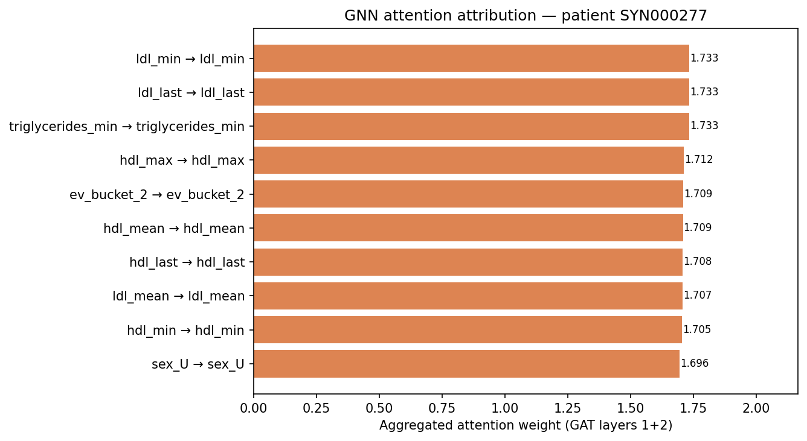

# Evidence trail — `SYN000277`

**Last observed HbA1c:** 8.14%
**Predicted next HbA1c:** 7.85%  (Δ -0.29)
**Engagement dropout risk:** 21%

## Evidence

_SHAP values not available — run `python -m explain.shap_analysis`._
## GNN attention attribution (top-10 edges)

_Aggregated attention weight across both GAT layers. Edges with higher weight contributed more to the model's prediction for this patient._

## Behavioral context (last 30 days)
- app_open: 37
- glucose_log: 17
- message_response: 11

## Reviewer checklist

- [ ] Evidence above is consistent with the patient's known history.
- [ ] Predicted trajectory is clinically plausible given evidence.
- [ ] Linked pathways match the clinical reasoning.
- [ ] No protected-class features appear to be driving the prediction.
- [ ] Behavioral context does not contradict the recommendation.

Reviewer signature: ____________________  Date: __________
