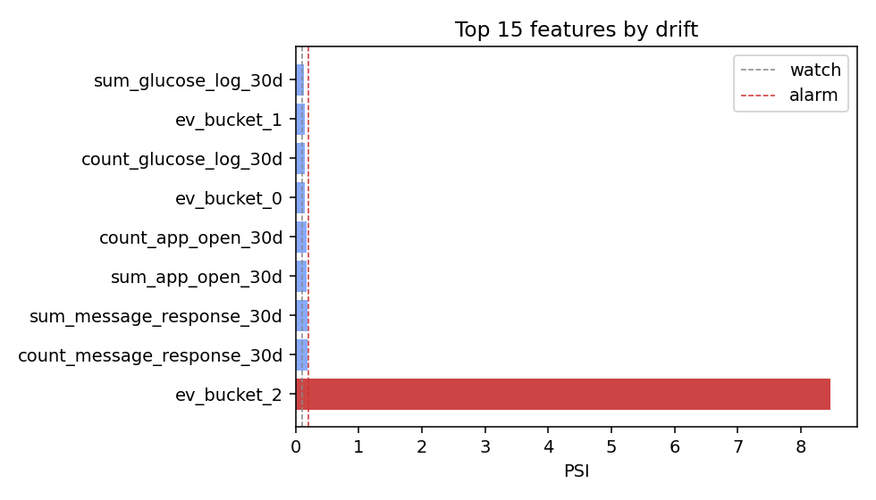

# Cohort drift monitor

_Comparing the most recent window to the cached training reference._

**1 alarming features** (PSI > 0.2).

| Feature | PSI | Ref mean | Cur mean | Interpretation |
|---------|-----|----------|----------|----------------|
| `ev_bucket_2` | 8.47 | 34.90 | 6.03 | down 28.87 vs reference |