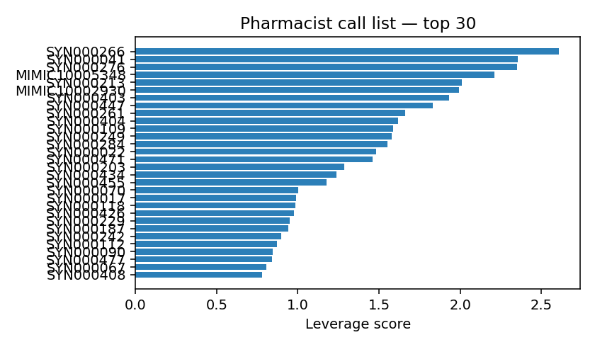

# Pharmacist intervention — weekly call list

_Top 30 patients by leverage score._

## Call queue

### `SYN000266` — score 2.61

- Last HbA1c **6.0%** → predicted **6.8%** (Δ +0.80)
- Glucose-logging dropoff: 67%
- Other failing metrics: 0

**Phone script:**
- Glucose logging dropped >40% over the last 30 days — confirm meter/CGM is working and reachable.
- Predicted HbA1c rise (+0.80%) — verify last refill date and pill-count.
- Ask about GI side effects (esp. for GLP-1 / metformin) and CGM tape skin reactions.
- Schedule a 90-day follow-up call to close the loop.

### `SYN000041` — score 2.35

- Last HbA1c **8.1%** → predicted **9.0%** (Δ +0.83)
- Glucose-logging dropoff: 47%
- Other failing metrics: 0

**Phone script:**
- Glucose logging dropped >40% over the last 30 days — confirm meter/CGM is working and reachable.
- Predicted HbA1c rise (+0.83%) — verify last refill date and pill-count.
- Ask about GI side effects (esp. for GLP-1 / metformin) and CGM tape skin reactions.
- Schedule a 90-day follow-up call to close the loop.

### `SYN000276` — score 2.35

- Last HbA1c **5.9%** → predicted **6.6%** (Δ +0.75)
- Glucose-logging dropoff: 56%
- Other failing metrics: 0

**Phone script:**
- Glucose logging dropped >40% over the last 30 days — confirm meter/CGM is working and reachable.
- Predicted HbA1c rise (+0.75%) — verify last refill date and pill-count.
- Ask about GI side effects (esp. for GLP-1 / metformin) and CGM tape skin reactions.
- Schedule a 90-day follow-up call to close the loop.

### `MIMIC10005348` — score 2.21

- Last HbA1c **5.7%** → predicted **7.1%** (Δ +1.36)
- Glucose-logging dropoff: 0%
- Other failing metrics: 1

**Phone script:**
- Predicted HbA1c rise (+1.36%) — verify last refill date and pill-count.
- Ask about GI side effects (esp. for GLP-1 / metformin) and CGM tape skin reactions.
- Schedule a 90-day follow-up call to close the loop.

### `SYN000213` — score 2.01

- Last HbA1c **8.7%** → predicted **9.2%** (Δ +0.49)
- Glucose-logging dropoff: 68%
- Other failing metrics: 0

**Phone script:**
- Glucose logging dropped >40% over the last 30 days — confirm meter/CGM is working and reachable.
- Predicted HbA1c rise (+0.49%) — verify last refill date and pill-count.
- Ask about GI side effects (esp. for GLP-1 / metformin) and CGM tape skin reactions.
- Schedule a 90-day follow-up call to close the loop.

### `MIMIC10002930` — score 1.99

- Last HbA1c **4.4%** → predicted **5.4%** (Δ +1.00)
- Glucose-logging dropoff: 0%
- Other failing metrics: 0

**Phone script:**
- Predicted HbA1c rise (+1.00%) — verify last refill date and pill-count.
- Ask about GI side effects (esp. for GLP-1 / metformin) and CGM tape skin reactions.
- Schedule a 90-day follow-up call to close the loop.

### `SYN000403` — score 1.93

- Last HbA1c **5.2%** → predicted **6.1%** (Δ +0.90)
- Glucose-logging dropoff: 9%
- Other failing metrics: 0

**Phone script:**
- Predicted HbA1c rise (+0.90%) — verify last refill date and pill-count.
- Ask about GI side effects (esp. for GLP-1 / metformin) and CGM tape skin reactions.
- Schedule a 90-day follow-up call to close the loop.

### `SYN000447` — score 1.83

- Last HbA1c **5.8%** → predicted **6.5%** (Δ +0.73)
- Glucose-logging dropoff: 25%
- Other failing metrics: 0

**Phone script:**
- Predicted HbA1c rise (+0.73%) — verify last refill date and pill-count.
- Ask about GI side effects (esp. for GLP-1 / metformin) and CGM tape skin reactions.
- Schedule a 90-day follow-up call to close the loop.

### `SYN000261` — score 1.66

- Last HbA1c **5.5%** → predicted **6.4%** (Δ +0.83)
- Glucose-logging dropoff: 0%
- Other failing metrics: 0

**Phone script:**
- Predicted HbA1c rise (+0.83%) — verify last refill date and pill-count.
- Ask about GI side effects (esp. for GLP-1 / metformin) and CGM tape skin reactions.
- Schedule a 90-day follow-up call to close the loop.

### `SYN000404` — score 1.62

- Last HbA1c **7.4%** → predicted **7.8%** (Δ +0.43)
- Glucose-logging dropoff: 50%
- Other failing metrics: 0

**Phone script:**
- Glucose logging dropped >40% over the last 30 days — confirm meter/CGM is working and reachable.
- Predicted HbA1c rise (+0.43%) — verify last refill date and pill-count.
- Ask about GI side effects (esp. for GLP-1 / metformin) and CGM tape skin reactions.
- Schedule a 90-day follow-up call to close the loop.

### `SYN000109` — score 1.59

- Last HbA1c **7.0%** → predicted **7.3%** (Δ +0.29)
- Glucose-logging dropoff: 67%
- Other failing metrics: 0

**Phone script:**
- Glucose logging dropped >40% over the last 30 days — confirm meter/CGM is working and reachable.
- Ask about GI side effects (esp. for GLP-1 / metformin) and CGM tape skin reactions.
- Schedule a 90-day follow-up call to close the loop.

### `SYN000249` — score 1.58

- Last HbA1c **5.8%** → predicted **6.3%** (Δ +0.50)
- Glucose-logging dropoff: 38%
- Other failing metrics: 0

**Phone script:**
- Predicted HbA1c rise (+0.50%) — verify last refill date and pill-count.
- Ask about GI side effects (esp. for GLP-1 / metformin) and CGM tape skin reactions.
- Schedule a 90-day follow-up call to close the loop.

### `SYN000284` — score 1.55

- Last HbA1c **7.0%** → predicted **7.6%** (Δ +0.62)
- Glucose-logging dropoff: 21%
- Other failing metrics: 0

**Phone script:**
- Predicted HbA1c rise (+0.62%) — verify last refill date and pill-count.
- Ask about GI side effects (esp. for GLP-1 / metformin) and CGM tape skin reactions.
- Schedule a 90-day follow-up call to close the loop.

### `SYN000022` — score 1.48

- Last HbA1c **8.4%** → predicted **8.7%** (Δ +0.37)
- Glucose-logging dropoff: 50%
- Other failing metrics: 0

**Phone script:**
- Glucose logging dropped >40% over the last 30 days — confirm meter/CGM is working and reachable.
- Predicted HbA1c rise (+0.37%) — verify last refill date and pill-count.
- Ask about GI side effects (esp. for GLP-1 / metformin) and CGM tape skin reactions.
- Schedule a 90-day follow-up call to close the loop.

### `SYN000471` — score 1.46

- Last HbA1c **6.5%** → predicted **7.1%** (Δ +0.59)
- Glucose-logging dropoff: 19%
- Other failing metrics: 0

**Phone script:**
- Predicted HbA1c rise (+0.59%) — verify last refill date and pill-count.
- Ask about GI side effects (esp. for GLP-1 / metformin) and CGM tape skin reactions.
- Schedule a 90-day follow-up call to close the loop.

### `SYN000203` — score 1.28

- Last HbA1c **5.4%** → predicted **5.9%** (Δ +0.56)
- Glucose-logging dropoff: 10%
- Other failing metrics: 0

**Phone script:**
- Predicted HbA1c rise (+0.56%) — verify last refill date and pill-count.
- Ask about GI side effects (esp. for GLP-1 / metformin) and CGM tape skin reactions.
- Schedule a 90-day follow-up call to close the loop.

### `SYN000434` — score 1.24

- Last HbA1c **5.3%** → predicted **5.7%** (Δ +0.41)
- Glucose-logging dropoff: 28%
- Other failing metrics: 0

**Phone script:**
- Predicted HbA1c rise (+0.41%) — verify last refill date and pill-count.
- Ask about GI side effects (esp. for GLP-1 / metformin) and CGM tape skin reactions.
- Schedule a 90-day follow-up call to close the loop.

### `SYN000455` — score 1.18

- Last HbA1c **6.3%** → predicted **6.9%** (Δ +0.59)
- Glucose-logging dropoff: 0%
- Other failing metrics: 0

**Phone script:**
- Predicted HbA1c rise (+0.59%) — verify last refill date and pill-count.
- Ask about GI side effects (esp. for GLP-1 / metformin) and CGM tape skin reactions.
- Schedule a 90-day follow-up call to close the loop.

### `SYN000070` — score 1.00

- Last HbA1c **7.2%** → predicted **7.6%** (Δ +0.38)
- Glucose-logging dropoff: 17%
- Other failing metrics: 0

**Phone script:**
- Predicted HbA1c rise (+0.38%) — verify last refill date and pill-count.
- Ask about GI side effects (esp. for GLP-1 / metformin) and CGM tape skin reactions.
- Schedule a 90-day follow-up call to close the loop.

### `SYN000017` — score 0.99

- Last HbA1c **5.6%** → predicted **5.9%** (Δ +0.24)
- Glucose-logging dropoff: 34%
- Other failing metrics: 0

**Phone script:**
- Ask about GI side effects (esp. for GLP-1 / metformin) and CGM tape skin reactions.
- Schedule a 90-day follow-up call to close the loop.

### `SYN000118` — score 0.99

- Last HbA1c **5.8%** → predicted **6.1%** (Δ +0.29)
- Glucose-logging dropoff: 27%
- Other failing metrics: 0

**Phone script:**
- Ask about GI side effects (esp. for GLP-1 / metformin) and CGM tape skin reactions.
- Schedule a 90-day follow-up call to close the loop.

### `SYN000426` — score 0.97

- Last HbA1c **7.7%** → predicted **7.6%** (Δ -0.01)
- Glucose-logging dropoff: 67%
- Other failing metrics: 0

**Phone script:**
- Glucose logging dropped >40% over the last 30 days — confirm meter/CGM is working and reachable.
- Ask about GI side effects (esp. for GLP-1 / metformin) and CGM tape skin reactions.
- Schedule a 90-day follow-up call to close the loop.

### `SYN000229` — score 0.95

- Last HbA1c **5.6%** → predicted **6.1%** (Δ +0.47)
- Glucose-logging dropoff: 0%
- Other failing metrics: 0

**Phone script:**
- Predicted HbA1c rise (+0.47%) — verify last refill date and pill-count.
- Ask about GI side effects (esp. for GLP-1 / metformin) and CGM tape skin reactions.
- Schedule a 90-day follow-up call to close the loop.

### `SYN000187` — score 0.94

- Last HbA1c **6.2%** → predicted **6.4%** (Δ +0.23)
- Glucose-logging dropoff: 32%
- Other failing metrics: 0

**Phone script:**
- Ask about GI side effects (esp. for GLP-1 / metformin) and CGM tape skin reactions.
- Schedule a 90-day follow-up call to close the loop.

### `SYN000242` — score 0.90

- Last HbA1c **6.8%** → predicted **6.9%** (Δ +0.03)
- Glucose-logging dropoff: 56%
- Other failing metrics: 0

**Phone script:**
- Glucose logging dropped >40% over the last 30 days — confirm meter/CGM is working and reachable.
- Ask about GI side effects (esp. for GLP-1 / metformin) and CGM tape skin reactions.
- Schedule a 90-day follow-up call to close the loop.

### `SYN000112` — score 0.87

- Last HbA1c **7.5%** → predicted **7.8%** (Δ +0.25)
- Glucose-logging dropoff: 25%
- Other failing metrics: 0

**Phone script:**
- Ask about GI side effects (esp. for GLP-1 / metformin) and CGM tape skin reactions.
- Schedule a 90-day follow-up call to close the loop.

### `SYN000090` — score 0.84

- Last HbA1c **6.0%** → predicted **6.3%** (Δ +0.35)
- Glucose-logging dropoff: 10%
- Other failing metrics: 0

**Phone script:**
- Predicted HbA1c rise (+0.35%) — verify last refill date and pill-count.
- Ask about GI side effects (esp. for GLP-1 / metformin) and CGM tape skin reactions.
- Schedule a 90-day follow-up call to close the loop.

### `SYN000477` — score 0.84

- Last HbA1c **7.7%** → predicted **8.2%** (Δ +0.50)
- Glucose-logging dropoff: 23%
- Other failing metrics: 1

**Phone script:**
- Predicted HbA1c rise (+0.50%) — verify last refill date and pill-count.
- Ask about GI side effects (esp. for GLP-1 / metformin) and CGM tape skin reactions.
- Schedule a 90-day follow-up call to close the loop.

### `SYN000067` — score 0.81

- Last HbA1c **6.7%** → predicted **7.0%** (Δ +0.36)
- Glucose-logging dropoff: 6%
- Other failing metrics: 0

**Phone script:**
- Predicted HbA1c rise (+0.36%) — verify last refill date and pill-count.
- Ask about GI side effects (esp. for GLP-1 / metformin) and CGM tape skin reactions.
- Schedule a 90-day follow-up call to close the loop.

### `SYN000408` — score 0.78

- Last HbA1c **5.7%** → predicted **6.1%** (Δ +0.39)
- Glucose-logging dropoff: 0%
- Other failing metrics: 0

**Phone script:**
- Predicted HbA1c rise (+0.39%) — verify last refill date and pill-count.
- Ask about GI side effects (esp. for GLP-1 / metformin) and CGM tape skin reactions.
- Schedule a 90-day follow-up call to close the loop.
