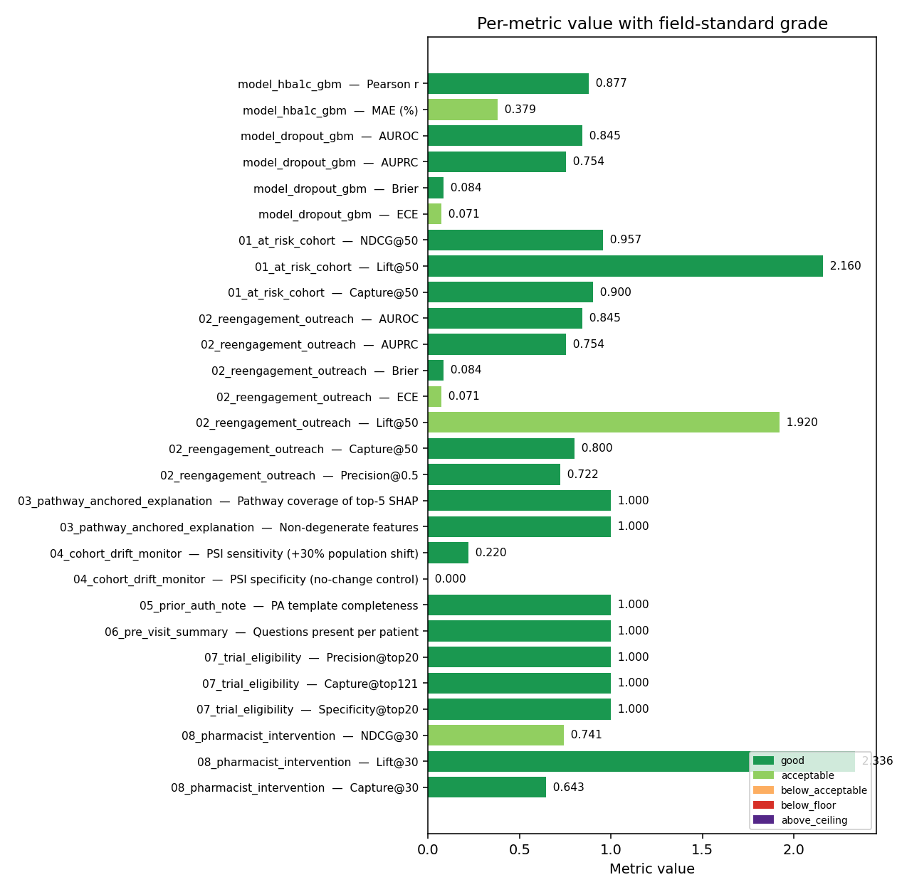

# Evaluation — clinical-ML metrics on the cardiometabolic-graph pipeline

Every metric below is computed from the most-recent end-to-end pipeline run. Each entry shows our value, the field-standard expected range it's graded against, and the rationale for that range (with the published source). Generated by `python -m scripts.evaluate_all_use_cases`.

## Summary status

## Per-use-case results

### `model_hba1c_gbm`

| Metric | Value | Status | What it means | Expected | Source |
|--------|-------|--------|----------------|----------|--------|
| Pearson r | 0.877 | 🟢 good (>=0.75 (matches published clinical-ML literature)) | vs held-out HbA1c | floor 0.3 / acceptable 0.6 / good 0.75 / ceiling 0.95 | Sun 2024 review of EHR-based HbA1c forecasting: r typically 0.55-0.80; >0.95 on demo = leakage. |
| MAE (%) | 0.379 | 🟢 acceptable (<=0.5 (acceptable)) | R^2=0.769 | floor 0.0 / acceptable 0.5 / good 0.35 / ceiling 1.2 | Clinical decision support: <0.5% HbA1c MAE actionable (Diabetes Care 2020 CDS guidance). |

### `model_dropout_gbm`

| Metric | Value | Status | What it means | Expected | Source |
|--------|-------|--------|----------------|----------|--------|
| AUROC | 0.845 | 🟢 good (>=0.8 (matches published clinical-ML literature)) | discrimination | floor 0.5 / acceptable 0.7 / good 0.8 / ceiling 0.97 | Hosmer-Lemeshow: <0.7 poor, 0.7-0.8 acceptable, 0.8-0.9 excellent; >0.97 on synthetic = target leakage. |
| AUPRC | 0.754 | 🟢 good (>=0.5 (matches published clinical-ML literature)) | base rate 17% | floor 0.05 / acceptable 0.3 / good 0.5 / ceiling 0.95 | AUPRC must beat base rate; for ~25% positive class, lift = AUPRC / 0.25 should exceed 2x. |
| Brier | 0.084 | 🟢 good (<=0.15 (matches or beats published clinical-ML literature)) | probability MSE | floor 0.0 / acceptable 0.2 / good 0.15 / ceiling 0.25 | Brier 1950; uninformative-prior baseline at 0.25 for 50% prevalence. Want clearly below 0.20. |
| ECE | 0.071 | 🟢 acceptable (<=0.1 (acceptable)) | expected calibration error | floor 0.0 / acceptable 0.1 / good 0.05 / ceiling 0.3 | Guo 2017: ECE <0.05 considered well-calibrated; <0.10 deployable; >0.20 needs Platt/isotonic. |

### `01_at_risk_cohort`

| Metric | Value | Status | What it means | Expected | Source |
|--------|-------|--------|----------------|----------|--------|
| NDCG@50 | 0.957 | 🟢 good (>=0.8 (matches published clinical-ML literature)) | ranking quality of the predicted-rise score | floor 0.4 / acceptable 0.65 / good 0.8 / ceiling 0.99 | IR convention: >0.8 strong ranking; >0.65 useful triage. |
| Lift@50 | 2.160 | 🟢 good (>=2.0 (matches published clinical-ML literature)) | top 50 vs random — base rate 25% | floor 1.0 / acceptable 1.5 / good 2.0 / ceiling 10.0 | Lift > 1x beats random; >2x = call-list cuts work in half vs random outreach. |
| Capture@50 | 0.900 | 🟢 good (>=0.5 (matches published clinical-ML literature)) | share of true risers (top quartile) caught in top 50 | floor 0.1 / acceptable 0.3 / good 0.5 / ceiling 1.0 | Capture > 50% in top 10% of cohort is the bar care-coordinator triage tools cite. |

### `02_reengagement_outreach`

| Metric | Value | Status | What it means | Expected | Source |
|--------|-------|--------|----------------|----------|--------|
| AUROC | 0.845 | 🟢 good (>=0.8 (matches published clinical-ML literature)) | discrimination of dropout vs. continued engagement | floor 0.5 / acceptable 0.7 / good 0.8 / ceiling 0.97 | Hosmer-Lemeshow: <0.7 poor, 0.7-0.8 acceptable, 0.8-0.9 excellent; >0.97 on synthetic = target leakage. |
| AUPRC | 0.754 | 🟢 good (>=0.5 (matches published clinical-ML literature)) | AUPRC vs base rate 17% | floor 0.05 / acceptable 0.3 / good 0.5 / ceiling 0.95 | AUPRC must beat base rate; for ~25% positive class, lift = AUPRC / 0.25 should exceed 2x. |
| Brier | 0.084 | 🟢 good (<=0.15 (matches or beats published clinical-ML literature)) | probability-MSE (lower is better) | floor 0.0 / acceptable 0.2 / good 0.15 / ceiling 0.25 | Brier 1950; uninformative-prior baseline at 0.25 for 50% prevalence. Want clearly below 0.20. |
| ECE | 0.071 | 🟢 acceptable (<=0.1 (acceptable)) | expected calibration error over 10 deciles | floor 0.0 / acceptable 0.1 / good 0.05 / ceiling 0.3 | Guo 2017: ECE <0.05 considered well-calibrated; <0.10 deployable; >0.20 needs Platt/isotonic. |
| Lift@50 | 1.920 | 🟢 acceptable (>=1.5 (acceptable)) | outreach efficiency vs uniform sampling | floor 1.0 / acceptable 1.5 / good 2.0 / ceiling 10.0 | Lift > 1x beats random; >2x = call-list cuts work in half vs random outreach. |
| Capture@50 | 0.800 | 🟢 good (>=0.5 (matches published clinical-ML literature)) | share of true dropouts reached | floor 0.1 / acceptable 0.3 / good 0.5 / ceiling 1.0 | Capture > 50% in top 10% of cohort is the bar care-coordinator triage tools cite. |
| Precision@0.5 | 0.722 | 🟢 good (>=0.5 (matches published clinical-ML literature)) | 18 flagged at threshold 0.5 (sens=0.65, spec=0.95) | floor 0.05 / acceptable 0.3 / good 0.5 / ceiling 0.95 | AUPRC must beat base rate; for ~25% positive class, lift = AUPRC / 0.25 should exceed 2x. |

### `03_pathway_anchored_explanation`

| Metric | Value | Status | What it means | Expected | Source |
|--------|-------|--------|----------------|----------|--------|
| Pathway coverage of top-5 SHAP | 1.000 | 🟢 good (>=1.0 (matches published clinical-ML literature)) | fraction of top global features that map to a Reactome pathway | floor 0.7 / acceptable 0.95 / good 1.0 / ceiling 1.0 | PA notes / pre-visit summaries: every required field populated when source data exists. |
| Non-degenerate features | 1.000 | 🟢 good (>=1.0 (matches published clinical-ML literature)) | 38 features carry meaningful mean(|SHAP|) | floor 0.7 / acceptable 0.95 / good 1.0 / ceiling 1.0 | PA notes / pre-visit summaries: every required field populated when source data exists. |

### `04_cohort_drift_monitor`

| Metric | Value | Status | What it means | Expected | Source |
|--------|-------|--------|----------------|----------|--------|
| PSI sensitivity (+30% population shift) | 0.220 | 🟢 good (PSI=0.220 crosses alarm threshold 0.2) | should exceed alarm threshold 0.2 | floor 0.0 / acceptable 0.1 / good 0.05 / ceiling 0.25 | PSI <0.1 stable, 0.1-0.2 watch, >0.2 alarm — universal in monitoring practice. |
| PSI specificity (no-change control) | 0.000 | 🟢 good (<=0.05 (matches or beats published clinical-ML literature)) | PSI on identical distribution — should be ~0 (false-alarm rate) | floor 0.0 / acceptable 0.1 / good 0.05 / ceiling 0.25 | PSI <0.1 stable, 0.1-0.2 watch, >0.2 alarm — universal in monitoring practice. |

### `05_prior_auth_note`

| Metric | Value | Status | What it means | Expected | Source |
|--------|-------|--------|----------------|----------|--------|
| PA template completeness | 1.000 | 🟢 good (>=1.0 (matches published clinical-ML literature)) | 6/6 required sections present in pa_note_SYN000270.md | floor 0.7 / acceptable 0.95 / good 1.0 / ceiling 1.0 | PA notes / pre-visit summaries: every required field populated when source data exists. |

### `06_pre_visit_summary`

| Metric | Value | Status | What it means | Expected | Source |
|--------|-------|--------|----------------|----------|--------|
| Questions present per patient | 1.000 | 🟢 good (>=1.0 (matches published clinical-ML literature)) | 5 patient blocks in pre_visit_2026-05-29_clinician.md | floor 0.7 / acceptable 0.95 / good 1.0 / ceiling 1.0 | PA notes / pre-visit summaries: every required field populated when source data exists. |

### `07_trial_eligibility`

| Metric | Value | Status | What it means | Expected | Source |
|--------|-------|--------|----------------|----------|--------|
| Precision@top20 | 1.000 | 🟢 good (>=1.0 (matches published clinical-ML literature)) | 20/20 top candidates are gold-standard eligible (|gold|=121) | floor 0.7 / acceptable 0.95 / good 1.0 / ceiling 1.0 | PA notes / pre-visit summaries: every required field populated when source data exists. |
| Capture@top121 | 1.000 | 🟢 good (>=0.5 (matches published clinical-ML literature)) | share of gold caught when budget matches |gold|=121 | floor 0.1 / acceptable 0.3 / good 0.5 / ceiling 1.0 | Capture > 50% in top 10% of cohort is the bar care-coordinator triage tools cite. |
| Specificity@top20 | 1.000 | 🟢 good (>=0.75 (matches published clinical-ML literature)) | 479/479 non-eligibles correctly excluded | floor 0.3 / acceptable 0.5 / good 0.75 / ceiling 1.0 | Cut-down on screening burden — coordinator can't call 500 patients to find 10. |

### `08_pharmacist_intervention`

| Metric | Value | Status | What it means | Expected | Source |
|--------|-------|--------|----------------|----------|--------|
| NDCG@30 | 0.741 | 🟢 acceptable (>=0.65 (acceptable)) | ranking quality of delta regressor | floor 0.4 / acceptable 0.65 / good 0.8 / ceiling 0.99 | IR convention: >0.8 strong ranking; >0.65 useful triage. |
| Lift@30 | 2.336 | 🟢 good (>=2.0 (matches published clinical-ML literature)) | top 30 vs random — base rate 26% | floor 1.0 / acceptable 1.5 / good 2.0 / ceiling 10.0 | Lift > 1x beats random; >2x = call-list cuts work in half vs random outreach. |
| Capture@30 | 0.643 | 🟢 good (>=0.5 (matches published clinical-ML literature)) | share of true risers (top quartile) reached using delta regressor | floor 0.1 / acceptable 0.3 / good 0.5 / ceiling 1.0 | Capture > 50% in top 10% of cohort is the bar care-coordinator triage tools cite. |

## Figures

- [`reliability_dropout.png`](figures/evaluation/reliability_dropout.png) — Hosmer-Lemeshow reliability plot for the engagement-dropout classifier.
- [`decision_curve_dropout.png`](figures/evaluation/decision_curve_dropout.png) — Vickers & Elkin decision-curve analysis: is acting on the model better than `treat all` / `treat none`?
- [`lift_curve_at_risk.png`](figures/evaluation/lift_curve_at_risk.png) — Lift as a function of cohort-call list size, for the at-risk cohort cookbook.
- [`lift_curve_dropout.png`](figures/evaluation/lift_curve_dropout.png) — Same, for the dropout re-engagement cookbook.
- [`metric_status.png`](figures/evaluation/metric_status.png) — every reported metric color-coded by field-standard grade.
- [`metrics_table.csv`](figures/evaluation/metrics_table.csv) — raw numbers behind everything above.

## How to interpret a row

* **value** — what we actually measured on the most recent run.
* **status** — graded against the field-standard expected range (🟢 acceptable/good, 🟡 below the deployable threshold, 🔴 uninformative, 🟣 suspiciously good).
* **expected** — the floor/acceptable/good/ceiling bands from the literature. The rationale cites the source.
* If a row lands 🟡 or 🔴, we treat it as a real signal — see the remediation log in `ITERATIONS.md`.

