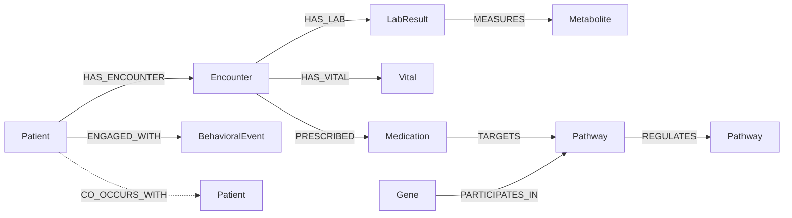

# Cardiometabolic patient knowledge graph — schema

This document is the single source of truth for the graph model. ETL scripts
under `etl/` enforce the node/edge types defined here, and tests in
[../tests/test_graph_schema.py](../tests/test_graph_schema.py) lock the
contract against drift.

## Why a graph

Cardiometabolic outcomes are driven by an interplay of three signal classes
that traditional tabular models flatten and lose context on:

1. **Clinical**: encounters, labs, vitals, medications.
2. **Behavioral**: physical activity, dietary recall, sleep, digital
   therapeutic app engagement.
3. **Molecular**: pathway membership, gene/metabolite involvement.

A graph keeps the relational structure — "this patient's glucose lab connects
through the insulin-signaling pathway to a gene set co-regulated with three
other patients in the same risk stratum" — so downstream GNNs can use
message-passing rather than hand-crafted joins.

## Node types

| Label             | Primary key            | Required properties                                                                | Source ETL          |
| ----------------- | ---------------------- | ---------------------------------------------------------------------------------- | ------------------- |
| `Patient`         | `patient_id`           | `sex`, `birth_year`, `cohort`                                                      | `load_mimic.py`     |
| `Encounter`       | `encounter_id`         | `patient_id`, `start_ts`, `encounter_type`                                         | `load_mimic.py`     |
| `LabResult`       | `lab_id`               | `patient_id`, `encounter_id?`, `loinc`, `name`, `value`, `unit`, `taken_ts`        | `load_mimic.py`     |
| `Vital`           | `vital_id`             | `patient_id`, `encounter_id?`, `kind` (BP/BMI/HR), `value`, `unit`, `taken_ts`     | `load_mimic.py`     |
| `Medication`      | `rx_id`                | `patient_id`, `rxnorm`, `name`, `start_ts`, `end_ts?`                              | `load_mimic.py`     |
| `BehavioralEvent` | `event_id`             | `patient_id`, `kind` (activity/diet/sleep/smoking/app_open/message), `ts`, `value` | `load_nhanes.py` + synthetic |
| `Pathway`         | `pathway_id` (Reactome / KEGG ID) | `name`, `source`                                                          | `load_pathways.py`  |
| `Gene`            | `gene_symbol`          | `entrez_id?`, `name?`                                                              | `load_pathways.py`  |
| `Metabolite`      | `chebi_id`             | `name`, `formula?`                                                                 | `load_pathways.py`  |

All node labels carry an `ingested_at` timestamp added by `build_graph.py`
for traceability.

## Edge types

| Type                  | From            | To               | Properties                          |
| --------------------- | --------------- | ---------------- | ----------------------------------- |
| `HAS_ENCOUNTER`       | `Patient`       | `Encounter`      | —                                   |
| `HAS_LAB`             | `Encounter`     | `LabResult`      | —                                   |
| `HAS_VITAL`           | `Encounter`     | `Vital`          | —                                   |
| `PRESCRIBED`          | `Encounter`     | `Medication`     | `dose?`, `route?`                   |
| `ENGAGED_WITH`        | `Patient`       | `BehavioralEvent`| —                                   |
| `MEASURES`            | `LabResult`     | `Metabolite`     | —                                   |
| `TARGETS`             | `Medication`    | `Pathway`        | `mechanism`                         |
| `PARTICIPATES_IN`     | `Gene`          | `Pathway`        | —                                   |
| `REGULATES`           | `Pathway`       | `Pathway`        | `direction` (up/down/cross-talk)    |
| `CO_OCCURS_WITH`      | `Patient`       | `Patient`        | `weight` (cosine on lab profile)    |

## Mermaid diagram

## Indexing strategy

See [cypher_constraints.cql](cypher_constraints.cql). Every node label has a
uniqueness constraint on its primary key, plus secondary indexes on the
common query paths (patient_id on `LabResult`, `Vital`, `Medication`,
`BehavioralEvent`; taken_ts on time-windowed reads).

## Why these specific signals

- **HbA1c, fasting glucose, lipid panel, BP, BMI**: standard cardiometabolic
  workup; chosen for high signal-to-noise and broad MIMIC coverage.
- **Physical activity, dietary recall, sleep, smoking**: NHANES carries
  decades of nationally-representative measurements; lets the model anchor
  patient-level signals against a population distribution.
- **Insulin signaling, glucose metabolism, lipid metabolism pathways**:
  the three Reactome super-pathways most directly implicated in T2D and
  metabolic syndrome; restricting scope keeps the graph tractable on a laptop
  without losing the most clinically actionable structure.
- **Synthetic engagement events**: stand in for digital-therapeutic app
  telemetry (opens, in-app messages responded to, glucose-log timestamps).
  Generated by [data/synthetic/generate_engagement_logs.py](../data/synthetic/generate_engagement_logs.py)
  with a documented mechanism so they can be regenerated deterministically.

## Lineage

Every node carries `source_system` (`mimic-iv-demo`, `nhanes-2017-18`,
`reactome-v89`, `kegg-2024-04`, `synthetic-v1`). Reviewers can trace any
prediction back through the chain of evidence.
